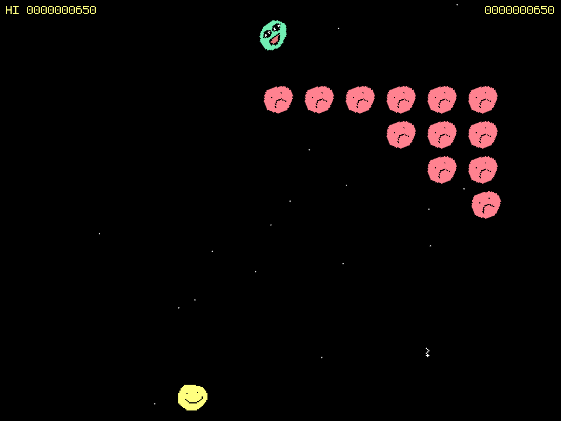

# Mark Invaders

Mark Invaders is a Space Invaders clone written in JavaScript with [Kaboom.js](https://kaboomjs.com/) made for both the [MarkJam](https://itch.io/jam/mark-jam) and [OGAM11](https://itch.io/jam/one-game-a-month-11). The game is available to play, for free, in your browser at: https://swilliamsio.itch.io/mark-invaders

All programming was done by [s-williams](https://github.com/s-williams). SFX was by [Kenny](https://kenney.nl/) and [Phoenix1291](https://opengameart.org/content/sfx-the-ultimate-2017-16-bit-mini-pack) available under [CC0](https://creativecommons.org/publicdomain/zero/1.0/). Music is [Chippin' Dancin' Desert! by TeraVex](https://www.newgrounds.com/audio/listen/997121) available under [CC-BY](https://creativecommons.org/licenses/by/3.0/).
